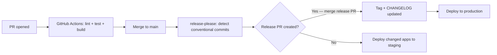

# Architecture — contentful/marketplace-partner-apps

## Overview

`contentful/marketplace-partner-apps` is a **Lerna + Nx monorepo** containing 38 partner-contributed Contentful Marketplace apps plus one shared component library. Apps in this repo are partner integrations — each is maintained by an external partner organization but hosted in this repo under Contentful governance.

This repo is the canonical home for apps that migrated from `contentful/apps` (e.g. Bynder, Cloudinary, Shopify, Frontify) and for new partner apps added via the partner app review process.

```
contentful/marketplace-partner-apps/
├── apps/                        # 38 partner apps
│   ├── bynder/
│   ├── cloudinary2/
│   ├── shopify/
│   └── ...
├── packages/                    # Shared libraries
│   └── contentful-app-components/   # @contentful/app-components
└── .github/workflows/           # GitHub Actions CI/CD
```

---

## Key Differences from `contentful/apps`

| Aspect | `contentful/apps` | `marketplace-partner-apps` |
|--------|-------------------|---------------------------|
| CI | CircleCI | **GitHub Actions** |
| Release system | Lerna conventional-commits | **release-please** (manifest mode) |
| Node version | ≥ 16, CI on 22 | **≥ 18, < 22** (CI on 20) |
| npm version | ≥ 8 | **≥ 9, < 11** |
| App owners | Contentful first-party | **Partner organizations** |
| New app process | Direct commit | **New app review workflow** (`.github/workflows/new-app-review.yml`) |
| Base branch | `master` | **`main`** |

---

## Monorepo Tooling

| Tool | Role |
|------|------|
| **Lerna 7** | Lifecycle orchestration — install, build, test, deploy |
| **Nx** | Build caching (`build`, `test`, `install-ci` are cacheable, cache dir: `/tmp/nxcache`) |
| **release-please** | Automated versioning and changelog generation via GitHub Actions |
| **GitHub Actions** | CI/CD (`.github/workflows/`) |

Lerna is configured with `"version": "independent"` — each app has its own version managed by `release-please`. Release PRs are created automatically when conventional commits are detected on `main`.

**Key Lerna script conventions:**
- `install-ci` (not `bootstrap`) — each app defines `install-ci` as its dependency install script
- `--since main` — only run against apps changed relative to `main`
- `build-apps:deploy` omits `--since` to build all apps for full deployment
- `deploy:staging` / `deploy:production` — deploys all apps concurrently (`--concurrency=3`)

---

## App Archetypes

### 1. Standard Vite App (majority — ~28 apps)
TypeScript + React + Vite. Same pattern as `contentful/apps`. Self-contained under `apps/<name>/`.

```
apps/<name>/
├── src/
│   ├── index.tsx
│   ├── App.tsx                  # Routes sdk.location → component
│   ├── locations/               # One file per App Framework location
│   ├── components/
│   ├── hooks/
│   └── utils/
├── package.json
├── vite.config.ts
└── index.html
```

### 2. DAM Base App
Thin wrapper around `@contentful/dam-app-base`. Only a connector entrypoint and logo.

```
apps/<name>/
└── src/
    └── index.js/ts    # Configures dam-app-base
```

Examples: `frontify`, `bynder` (partial — also has custom Sidebar)

### 3. Ecommerce Base App
Wraps `@contentful/ecommerce-app-base`.

```
apps/<name>/
└── src/
    ├── index.js           # Mounts ecommerce-app-base
    └── dataTransformer.js # Maps vendor product shape to base-app format
```

Example: `shopify`

### 4. Next.js App (rare)
`translationstudio` uses **Next.js**, not Vite. It has `pages/`, `next.config.js`, and is served via `serve` for the Contentful iframe embed.

### 5. Non-Standard
`sfmc-studio` uses Ant Design + Redux Toolkit and has an app-directory-style `src/app/` structure. It is the primary exception to the standard Forma 36 + Vite conventions.

---

## Shared Package

### `@contentful/app-components`
Reusable React components for Contentful apps, shared across partner apps in this repo. Used by `lottie-preview` and potentially others. Check `packages/contentful-app-components/src/` for available components before building custom equivalents.

---

## Key Dependencies (Common Across Apps)

| Package | Purpose |
|---------|---------|
| `@contentful/app-sdk` | Core App Framework SDK |
| `@contentful/react-apps-toolkit` | React hooks: `useSDK()`, `useAutoResizer()`, `useCMA()` |
| `@contentful/f36-components` | Forma 36 React UI (mandatory for standard apps) |
| `@contentful/f36-tokens` | Design tokens |
| `contentful-management` | CMA JavaScript client |
| `@contentful/dam-app-base` | DAM integration base library |
| `@contentful/ecommerce-app-base` | Ecommerce integration base library |
| `@contentful/app-components` | Shared components (internal to this repo) |

**Notable exceptions:**
- `sfmc-studio` uses **Ant Design** (`antd`) instead of Forma 36 — it predates or opted out of the F36 requirement
- `transifex` uses JSX (`.jsx`) rather than TypeScript

---

## CI/CD Pipeline



**New app submissions** go through `.github/workflows/new-app-review.yml` — a multi-step review gate that checks app manifest, bundle, and policy compliance before an app is accepted into the repo.

### Release Flow
- `release-please` creates a release PR per app when conventional commits land on `main`
- Merging the release PR creates a git tag and updates `CHANGELOG.md`
- The `release-and-deploy.yml` workflow then deploys the tagged app to production
- Non-release merges deploy changed apps to **staging** automatically

### Deployment
- Production: `lerna run deploy --concurrency=3` (all apps)
- Staging: `lerna run deploy:staging --concurrency=3` (changed apps)
- Requires `CONTENTFUL_CMA_TOKEN`, `DEFINITIONS_ORG_ID` (production) and `TEST_CMA_TOKEN`, `TEST_ORG_ID` (staging)

---

## Data Flows

### Standard App SDK Flow (same as contentful/apps)
```
Browser → Contentful Web App
  → iframe loads app bundle
  → App SDK initializes
  → App reads/writes via sdk.entry, sdk.field, sdk.space
```

### DAM Base App Flow
```
User clicks "Select Asset" → dam-app-base opens Dialog
  → Dialog calls partner SDK (Bynder/Frontify/etc.)
  → Partner SDK opens picker (popup or embedded)
  → User selects assets → returned to dam-app-base
  → dam-app-base writes asset data to Contentful field
```

---

## Invariants & Sharp Edges

- **Node ≥ 18, < 22** — do not use Node 22+ features; the upper bound is enforced.
- **`npm ≥ 9, < 11`** — npm 8 scripts may work but are not the supported toolchain.
- **Base branch is `main`**, not `master` — all `--since` flags use `main`.
- **`install-ci`** (not `bootstrap`) — apps define their install step as `npm run install-ci` which maps to `npm ci`. Run this instead of plain `npm install` in CI-like contexts.
- **release-please, not lerna version** — do not manually bump versions or run `lerna version`. All version management is done by release-please via PR.
- **`build-apps:deploy` skips `--since`** — it builds everything; only use for full deploys, not local dev.
- **`sfmc-studio` uses Ant Design** — do not apply F36-only assumptions to this app.
- **`translationstudio` is Next.js** — Vite patterns do not apply; check `next.config.js` instead of `vite.config.ts`.
- **Partner ownership** — each app is owned by a partner. Contentful's role is repo governance, not feature development. Changes to partner apps should be minimal and backwards-compatible unless coordinated with the partner.
- **`lerna.json` ignores `**/*.md` and `**/package-lock.json`** — changes to these files never trigger a release.
