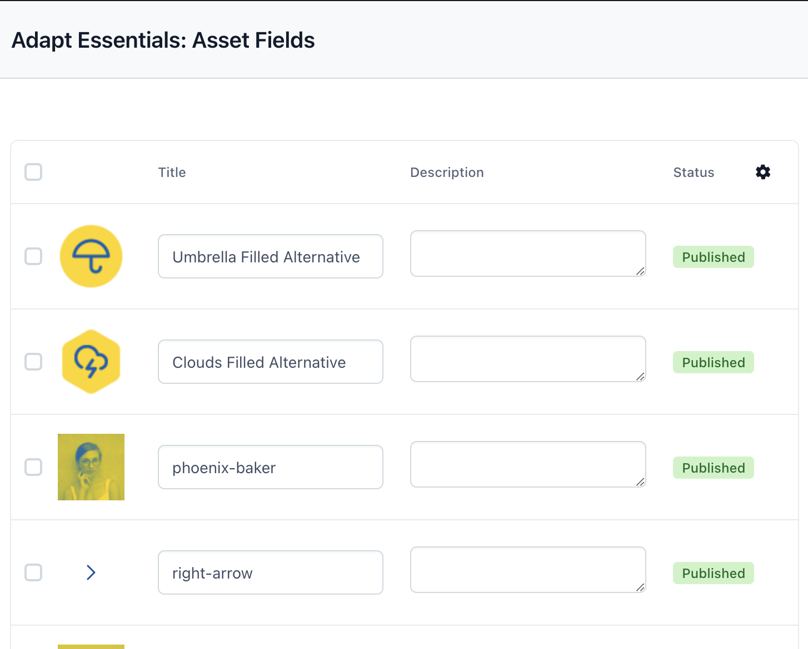
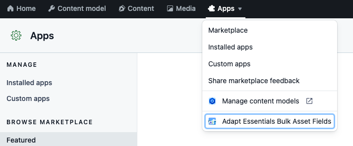
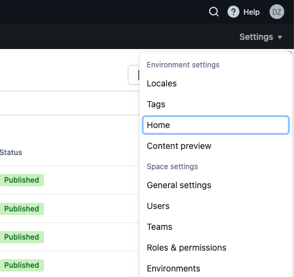
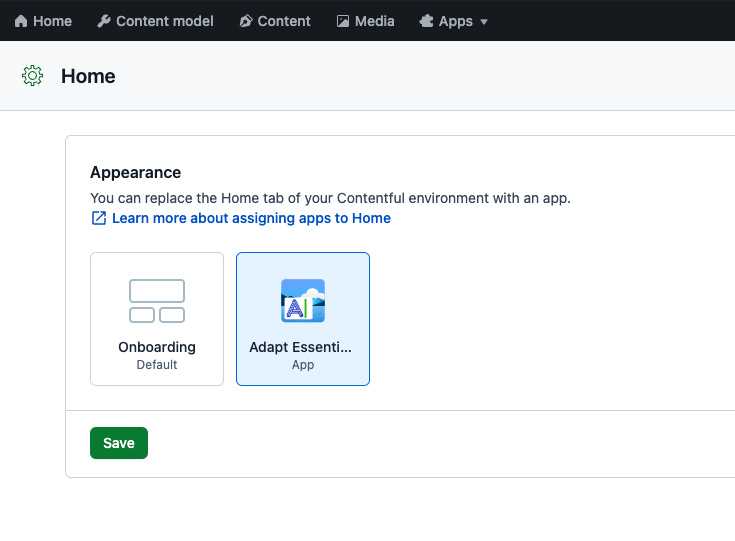
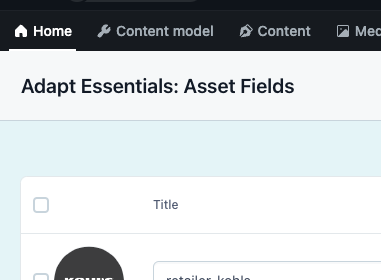

 

# Adapt Essentials: Asset fields

An App for making it easier to change title, description and filename of assets in bulk.

It supports in place editing for multiple locales.

## Why?

The common pattern for adding alt and description to the image is to upload the asset and reference
it with dedicated wrapper content type. Which makes it a bit tedious for the editors.

The lean solution is to use title and description fields of the asset itself for the alt and description image
attributes.
But you can't impose any requirements that way. So it is easy to forget to fill in the title and description fields.

This app makes it easier to go through assets and edit it in bulk.

## Bug reports

If you've found any issues, please open an issue here:
[https://github.com/adaptdk/adapt-essentials-asset-fields/issues](https://github.com/adaptdk/adapt-essentials-asset-fields/issues)

## Feature requests

If you think the application is missing any features, please open an issue here:
[https://github.com/adaptdk/adapt-essentials-asset-fields/issues](https://github.com/adaptdk/adapt-essentials-asset-fields/issues)

## [Privacy Policy](https://adaptagency.com/privacy-policy)

<!--- App part -->

## How to use it?

You can find the app at https://app.contentful.com/spaces/<space_id>/apps/app_installations/adapt-essentials-bulk-asset-fields/

### Access it through **Apps** menu

Once app is installed it can be accessed through **Apps** menu.

1. Ensure that you are in the **Main** environment.
2. In the menu, there is a **Apps** menu entry with a dropdown.
3. Click it.
4. Once dropdown is open, click **Adapt Essentials Bulk Asset Fields** entry to open it.

### Set is as **Home** app

The app can be set as a homepage which will be displayed once you log into Contentful.

1. On the right bellow the user avatar there is a **Settings** menu.
2. Click **Settings**. Dropdown will open.
3. Click **Home** withing dropdown.
   
4. Home appearance customizations window open.
5. Select **Adapt Essenti...** as your homepage app.
6. Click Save.
   
7. Now you can access app at https://app.contentful.com/spaces/<space_id>/home or by clicking Home in the menu.
   

---

The app itself is really simple.
Assets are listed with the title, description and status.

You can edit the fields in place.

The changes are saved automatically. You can also toggle additional fields or locale.

