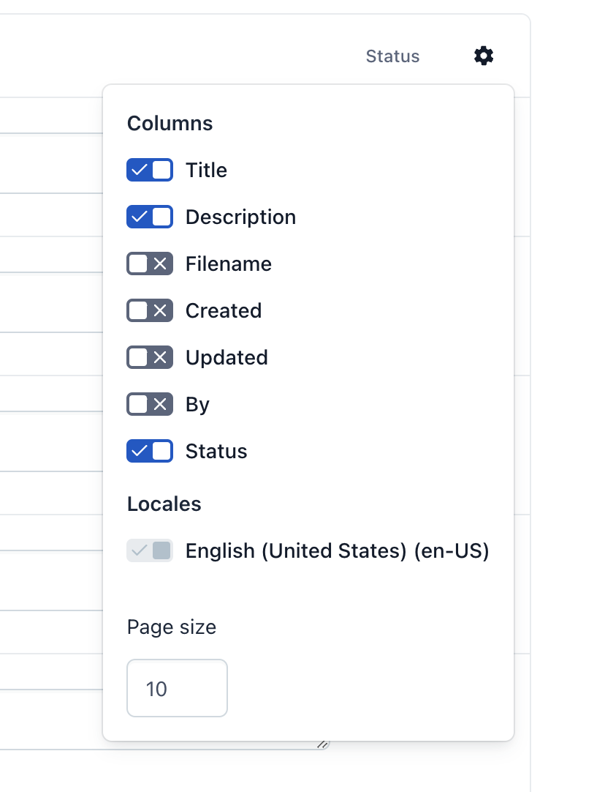

 

# Adapt Essentials: Asset fields 

An App for making it easier to change title, description and filename of assets in bulk. It supports in place editing for multiple locales.

## Why?

The common pattern for adding alt and description to the image is to upload the asset and reference it with dedicated wrapper content type. Which makes it a bit tedious for the editors.

The lean solution is to use title and description fields of the asset itself for the alt and description image attributes. But you can't impose any requirements that way. So it is easy to forget to fill in the title and description fields.

This app makes it easier to go through assets and edit it in bulk.

## How to use it?

The app itself is really simple. Assets are listed with the title, description and status. You can edit the fields in place. The changes are saved automatically. You can also toggle additional fields or locale.

## Bug reports

If you've found any issues, please open an issue here: [https://github.com/adaptdk/adapt-essentials-asset-fields/issues](https://github.com/adaptdk/adapt-essentials-asset-fields/issues)

## Feature requests

If you think the application is missing any features, please open an issue here: [https://github.com/adaptdk/adapt-essentials-asset-fields/issues](https://github.com/adaptdk/adapt-essentials-asset-fields/issues)

## [Privacy Policy](https://adaptagency.com/privacy-policy)
