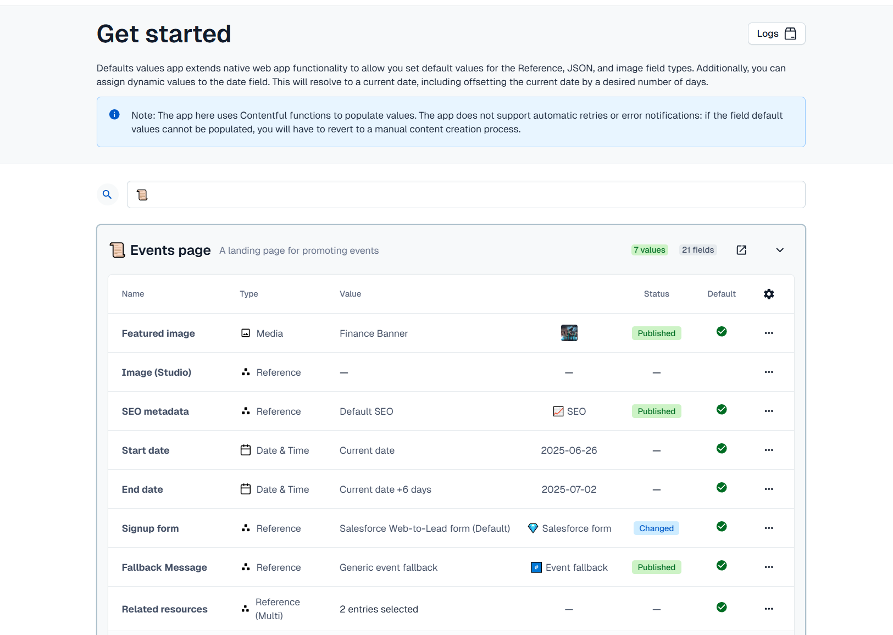
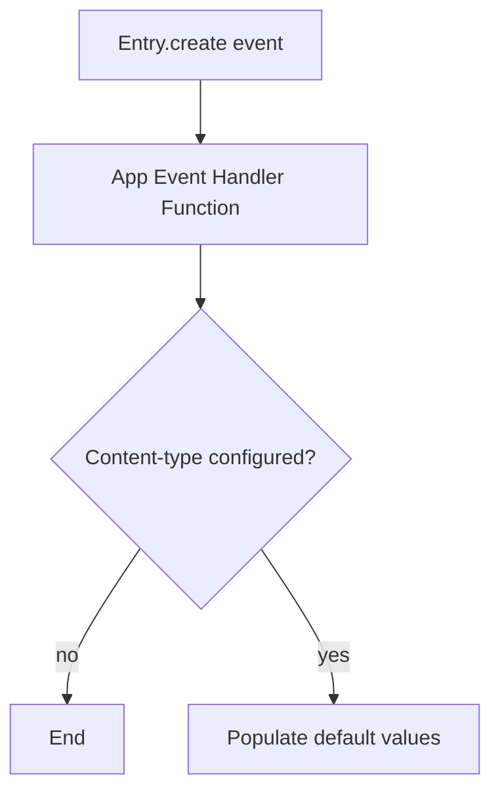

# Defaults – Contentful App

This project implements a **Contentful App** that enriches newly created entries with default values via an **App Event Handler Function**. Everything you need to understand, develop, test and deploy lives in this repository.

---

## Local development

```bash
# install
npm install

# local dev
npm dev

# unit tests (Vitest)
npm test

# production build (front-end + functions)
npm build
```

When the app runs **outside** of Contentful you will see the `LocalhostWarning` component. Install and open the app inside Contentful to see the real screens.

---

## Locations

| Location constant     | Component      | Responsibility                                      |
| --------------------- | -------------- | --------------------------------------------------- |
| `LOCATION_APP_CONFIG` | `ConfigScreen` | Configure which content-types & fields get defaults |



---

## Serverless Function (`functions/appeventHandler.ts`)

• Trigger: **Entry.create**

**Behaviour**

1. Fetch the freshly created entry via CMA.
2. Read the app-installation parameters (see next section).
3. If the affected content-type is configured, populate default values for empty fields (dates, links, assets, entries, JSON).
4. Save and, if the entry was previously published, re-publish it so the defaults show up in the UI.



---

## App&nbsp;Installation Parameters Schema

The Config screen stores a JSON object with the following shape:

```ts
interface AppInstallationParameters {
  contentTypes?: {
    [contentTypeId: string]: {
      enabled: boolean;
      fields: {
        [fieldId: string]: {
          fieldType:
            | "Date"
            | "Asset"
            | "Entry"
            | "JSON"
            | "AssetArray"
            | "EntryArray";
          defaultValue: {
            type:
              | "current-date" // now().toISOString()
              | "offset-date" // now() ± offset days
              | "start-of-month"
              | "asset"
              | "entry" // link(s) by ID
              | "json";
            value?: any;
          };
        };
      };
    };
  };
}
```

Example:

```json
{
  "contentTypes": {
    "blogPost": {
      "enabled": true,
      "fields": {
        "publishDate": {
          "fieldType": "Date",
          "defaultValue": { "type": "current-date" }
        },
        "heroImage": {
          "fieldType": "Asset",
          "defaultValue": {
            "type": "asset",
            "value": "4hT2xA2fd342pa1zMx"
          }
        }
      }
    }
  }
}
```

---

## Deployment to Contentful

1. `npm build` – produces `build/` (front-end) and `build/functions/`.
2. `npm upload` – uploads the bundle and lets you activate it (use `upload-ci` for CI pipelines).
3. `npm create-app-event` – create an event subscription connecting `Entry.create` events to your function.

Afterwards, creating an entry that matches the configuration will automatically be enriched with your defaults.

---

## Testing

```bash
npm test
```
