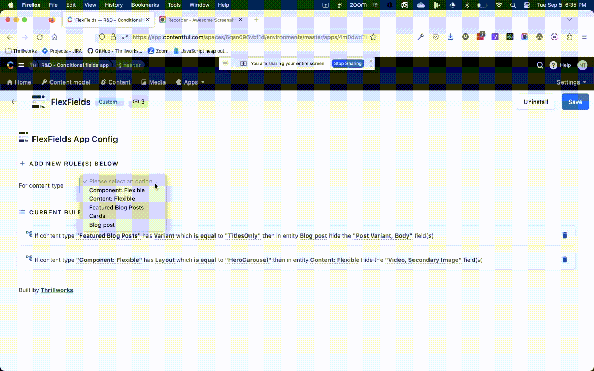

This app give the ability to hide fields conditionally based on configuration. It uses a custom entry editor tab for FlexFields that renders only the fields not hidden by the config. This entry editor is updated auotmatically as the default entry editor for all the content types added in the configuration (both the driving content types as well as the affected content types).

This app uses [Contentful Field Editors](https://www.contentful.com/developers/docs/extensibility/field-editors/)

## Local setup

This project was bootstrapped with [Create Contentful App](https://github.com/contentful/create-contentful-app).

- `npm start` - Run the app locally.
- `npm run build` - Create the bundle to be deployed in Contentful
- `npm run build:autoincrement` - Autoincrement the version number in package.json then create the bundle to be deployed in Contentful
- `npm run upload` - Interactive command to upload the bundle to Contentful
- `npm run upload-ci` - Non interactive command to upload bundle using environment variables (`CONTENTFUL_ORG_ID`, `CONTENTFUL_APP_DEF_ID`, `CONTENTFUL_ACCESS_TOKEN`)

Read [here](https://www.contentful.com/developers/docs/extensibility/app-framework/create-contentful-app/#deploy-with-contentful) for more information about the deployment process.

## Configuration

The rules are configured in a top down approach, starting with the condition.

1. Select the content type that drives the condition
2. Select the field, and the condition that triggers the hiding of fields
3. Select the affected content type (can be same content type or any content types included in reference fields)
4. Select the fields to hide

The configured rules will be listed under `Current Rules`, any unwanted rules can be deleted.

**_Note:_** Make sure to save the configuration on any update of the rules

**_Note:_** Reload the entry editors for any update in configuration

