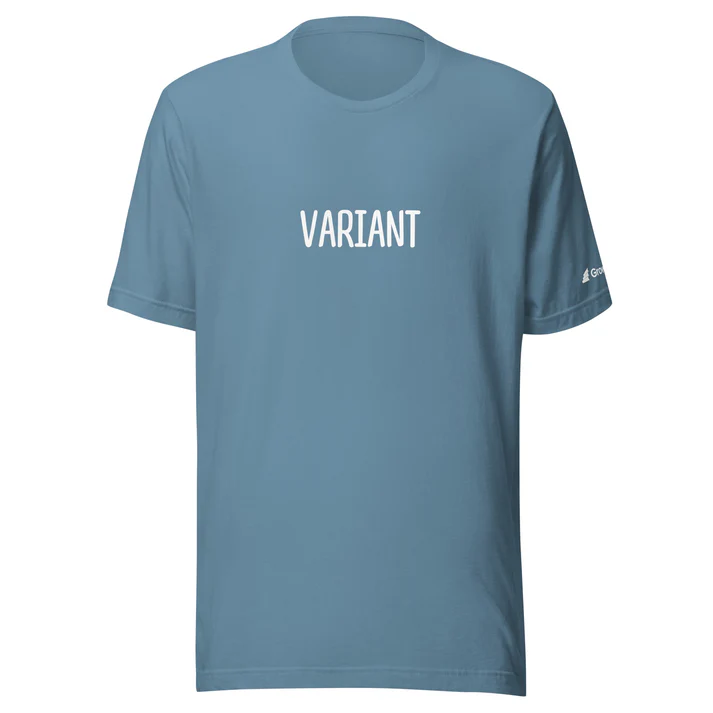
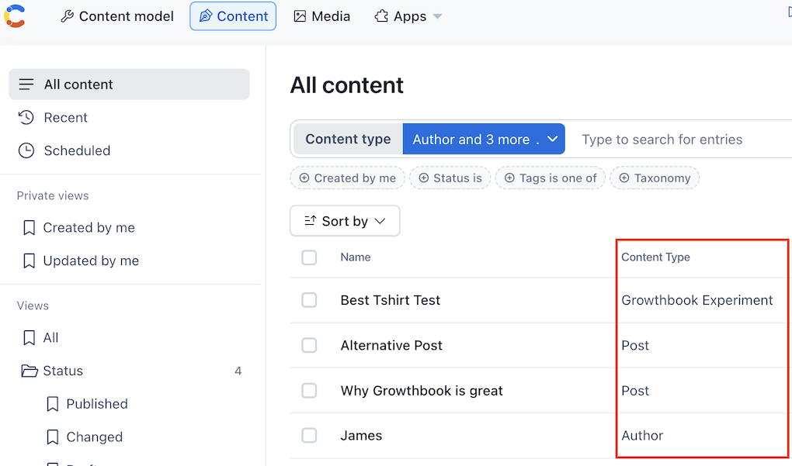
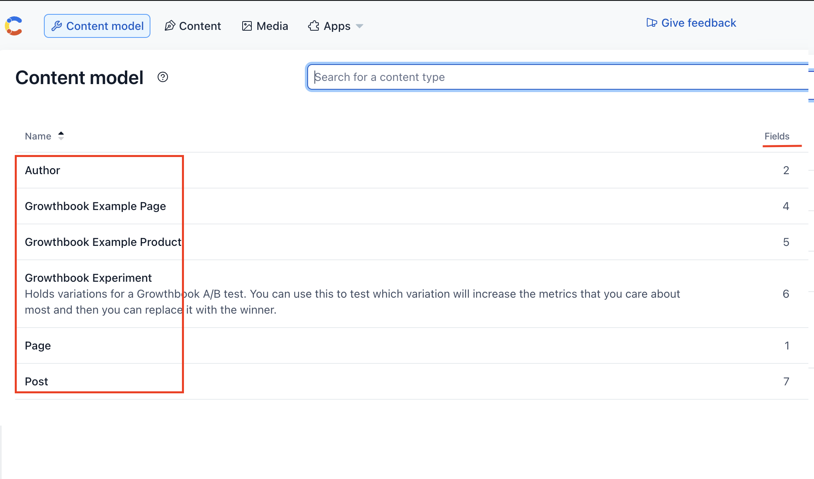
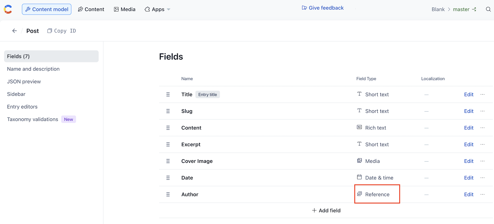
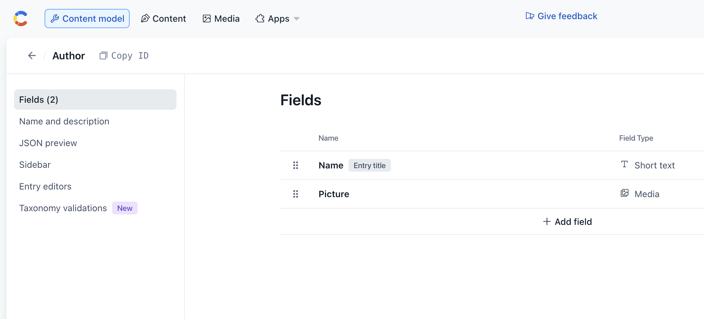

  
  

Which of these tshirts will sell more? Once set up by developers, the Growthbook app within Contentful lets content creators and managers run A/B tests on their own content all by themselves.

## What is the Growthbook app for Contentful?

[Growthbook](https://growthbook.io) is an open-source platform for feature flagging and A/B testing built for data teams, engineers, and product managers. Now by adding the [Growthbook app](https://app.contentful.com/deeplink?link=apps&id=growthbook) to your Contentful Space, you can bring the power of running A/B tests directly into the hands of the content creators and managers as well. Soon they will be able to figure out on their own what headlines, articles, images, or products perform the best to maximize the metrics you care about most.

This article explains exactly how content creators can create their own experiments, then backtracks and explains how engineers and administrators can set it all up to make that possible.

## How Content Creators Can Run Their Own Experiment

### A quick refresher on how content is structured on Contentful

All content on Contentful has a `Content Type` which are defined in `Content Models`. Each `Content Model` can have many `Fields` which determine what information content with a particular content type should have.

  
  

Those fields have their own `Field Types`, such as "Short Text", "Media", or "Reference". References point to another piece of content. In the example below the "Post" `Content Model` has an "Author" field, which is a "Reference" to another piece of content which has the "Author" `Content Type`, which itself has the author's name and an image.

  
  

### Creating a Growthbook Experiment

The Growthbook App comes with a "Growthbook Experiment" `Content Type`. Creating a new experiment is as simple as replacing the content in any "Reference" field or "References, many" field (a list of references) with a reference to a piece of content that has the "Growthbook Experiment" content type. You can then include the original reference and any other variant of it in the variations field.

Let's say that you have a product page which has a "Products" field which is a "References, many" field type. You would like to see if a particular product sells more if you changed which product is featured. You can then remove that product and replace it with a new piece of content of "Growthbook Experiment" type. The

### FAQ:

#### I just want to test out changing some text, how do I do that?

The Growthbook Plugin only works on References to Content.
If you just want to test out some particular text on the product, say a Call To Action, and don't want to make a copy of the entire content, you can make a new `CTA` content model that just has a single piece of text. Products could then replace their CTA text with a reference to a `CTA` Content Type. As with all Content Types, developers would need to make sure your frontend application can correctly display them.

## Installation and Configuration
