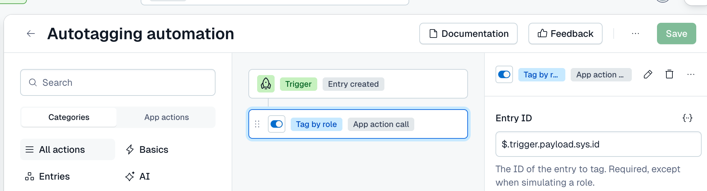

# Role auto tagger

A Contentful App Framework app that tags new entries automatically, based on the roles of the user
who created them.

An admin maps each role in a space to a set of tags. When an entry is created, a Contentful
Automation calls this app's **Auto-tag by Role** App Action. The action reads who created the entry,
looks up their roles, and adds the tags mapped to those roles.

There is no editor-facing UI. The app's only screen is its configuration screen, which has two tabs:
**Configuration** and **Troubleshooting**.

---

## Which path are you on?

| You want to… | Read |
|---|---|
| **A. Use the app in your space.** Someone has already deployed it and made it available to your organization | [A. Set it up in a space](#a-set-it-up-in-a-space) |
| **B. Run your own copy.** Deploy it to your own Contentful organization | [B. Deploy your own copy](#b-deploy-your-own-copy), then path A |
| **C. Change the code** | [C. Develop the app](#c-develop-the-app) |

[Troubleshooting](#troubleshooting) applies to everyone.

---

## What every path needs

- **Tags named `Group: value`,** for example `Region: EMEA` or `Team: Marketing`.
  - Only grouped tags can be mapped.
  - An admin chooses which groups the app may apply.
- **Contentful Automations in the space.** The app is triggered by an Automation, so check that
  your space's plan includes them.
- **A dedicated space-admin user and its personal access token.** See
  [The token the app needs](#the-token-the-app-needs).

---

## The token the app needs

The app reads the space's members and roles to find out which roles an entry's creator holds. An
app's own identity is not allowed to read either: both return `401 AccessTokenInvalid`. So the app
uses a personal access token (PAT), saved on its config screen.

**The token's user must be a space admin** in every space the app is installed in. A non-admin
cannot read the space's roles.

The token is used for **two reads only**: the space's members and its roles. Reading the entry,
reading tags and writing tags all use the app's own identity, so the tags an entry receives are
recorded as written by the app, not by this user.

To create one:

1. **Create a dedicated user**, for example `role-tagger-bot@yourcompany.com`, rather than using
   a person's own account. A PAT can do anything its user can, so this keeps that power off a
   person's account.
2. **Make that user an admin of each space** the app is installed in, and of no others.
   - In an organization that manages access through Teams, add the user to a team that has admin
     on those spaces.
3. **Sign in as that user** and go to **Account settings → CMA tokens**
   (`https://app.contentful.com/account/profile/cma-tokens`).
4. **Generate a personal token.** Name it after the app and **set an expiry**.
5. **Copy the token now.** Contentful shows it only once.
6. **Paste it** into the app's config screen (path A, step 2).
7. **When it expires,** generate a new one and save it in each space.

---

## A. Set it up in a space

### 1. Install the app

1. In the space, go to **Apps → Manage apps**.
2. Find **Role auto tagger** among the apps available to your organization.
   - It is listed if it was deployed to your organization, or published by its owner.
   - If you can't find it, ask whoever deployed it.
3. Click **Install**, and choose the **environment**.

App installations are per space **and** per environment, so repeat this for every environment that
needs tagging.

### 2. Configure it

The config screen opens on the **Configuration** tab:

| Setting | What to do |
|---|---|
| **CMA token** | Paste the token from [The token the app needs](#the-token-the-app-needs). It is stored encrypted. After saving, it shows as already set, and leaving it blank keeps it |
| **Tag groups** | Switch on the groups whose tags the app may apply. Tags outside an enabled group are never applied, even if they are mapped |
| **Role auto-tagging** | Open each role and tick the tags its members' entries should receive. The list is searchable and shows 20 tags per page |

Click **Save** (top right).

### 3. Create the Automation

**Saving the config screen does not start tagging.** Tagging runs only when an Automation calls the
app. Create one in the **same space and environment** as the installation:

1. Go to **Automations** in the space and create a new one. Give it a name, such as
   *Autotagging automation*.
2. Set the **Trigger** to **Entry created**.
3. In the left panel, open the **App actions** tab and add this app's **Auto-tag by Role**. It appears
   in the flow as an **App action call** step.
   - You can rename the step itself, as the screenshot does with *Tag by role*. The action it calls
     is what matters.
4. Select the step. In the right panel, set **Entry ID** to:

   ```
   $.trigger.payload.sys.id
   ```

   That is the ID of the entry that fired the trigger. The `{…}` button beside the field inserts
   values from the trigger, so you can pick it there instead of typing it.
   - **This is the one setting that must be right.** A fixed ID would tag the same entry every time.
5. Leave **Dry run** and **Simulate role** empty. They exist for the Troubleshooting tab.
6. Make sure the step's toggle is on, then click **Save**.



The app does not create the Automation for you:
- **Permissions:** apps are not permitted to create Automations.
- **Control:** a step you can see, scope and switch off is better than one an app sets up silently.

### 4. Check it

1. **Run the Troubleshooting tab.** On the config screen, open **Troubleshooting**, choose a role and
   click **Run test**. It shows the tags an entry created by someone with that role would receive,
   and changes nothing. See [Troubleshooting](#troubleshooting).
2. **Create a real entry** as a user who holds a mapped role, not as a space admin, since admins hold
   no roles. The tags should appear on it within a few seconds.
3. **If they don't appear,** check the Automation's run history first, then the Troubleshooting tab.

### Change the configuration later

Edit the config screen and **Save**. The next entry created uses the new mapping. Entries that
already exist are **not** retagged.

### Remove the app

1. **Disable or delete the Automation**, so nothing calls the app.
2. **Uninstall the app:** Apps → Manage apps → Role auto tagger → Uninstall. Do this in each
   environment where it is installed.
3. **Revoke the token** if no other space uses it: sign in as the token's user, go to
   Account settings → CMA tokens, and revoke it.

Uninstalling removes no tags. Tags the app has already applied stay on their entries.

---

## B. Deploy your own copy

This creates the app in **your** Contentful organization. Each step is safe to re-run.

### Requirements

- **Node 20.19 or newer, and npm 9 or newer.** Check with `node --version` and `npm --version`. CI
  for Contentful Marketplace apps runs Node 20, and the app is tested there.
- **Access to this repository.**
  - It is private, so ask its owner to add you.
- **Rights to manage apps in your Contentful organization.**
- **A CMA personal access token for yourself** with those rights, used by the setup scripts. This is
  a different token from the one the app uses in each space.

### 1. Get the code and install dependencies

```bash
git clone https://github.com/<owner>/role-auto-tagger.git
cd role-auto-tagger
npm install
```

The repository's `.npmrc` sends `@contentful/*` packages to the public npm registry. Keep it. If
your own `~/.npmrc` points `@contentful` at a private registry, `npm install` otherwise fails with a
`401 Unauthorized` that looks like a login problem.

### 2. Configure the setup scripts

```bash
cp .env.example .env
```

Then set two values:
- `CONTENTFUL_ORG_ID`: your organization's ID, from Organization settings (it is in the URL).
- `CONTENTFUL_ACCESS_TOKEN`: your own CMA token.

Leave `CONTENTFUL_APP_DEF_ID` empty for now. `.env` is gitignored, so it is never committed.

These values are used only by the scripts in `tools/`. The deployed app never reads `.env`.

### 3. Create the app definition

```bash
npm run create-app-definition
```

This prints a line `CONTENTFUL_APP_DEF_ID=…`. Paste it into `.env`.

### 4. Declare the installation parameters

```bash
npm run sync-parameters
```

**Run this before anyone saves the config screen.** Contentful checks a saved configuration against
the parameters the app definition declares, and rejects anything undeclared with
`422 The property X is not expected`.

### 5. Build and deploy

```bash
npm run build         # the config screen and the App Function
npm run upload-ci     # upload the bundle, without activating it
npm run activate      # attach the bundle and set the app's locations
npm run sync-action   # create the "Auto-tag by Role" App Action
```

Check the result:

```bash
npm run show-definition
```

It should show:
- **location:** `app-config`
- **parameters:** `enabledTagGroups`, `roleTagMapping` and `cmaToken`
- **App Actions:** exactly one

It flags anything else.

### 6. Make it available, then follow path A

The app can now be installed in any space in **your** organization.

**Other organizations cannot see it yet.** An app definition is private to the organization that owns
it until it is made public, which opens it to every organization. Make it public only if that is
what you want. Otherwise, install it from within your own organization.

Then continue with [A. Set it up in a space](#a-set-it-up-in-a-space).

### Deploy a new version

After changing the code:

```bash
npm run build && npm run upload-ci && npm run activate && npm run sync-action
```

- **Run `npm run sync-parameters` as well** if the change added or removed an installation
  parameter.
- **`sync-action` is only needed** if the App Action's parameters changed, but it is safe to run
  every time.
- **Installed spaces pick up the new version immediately.** Reload the web app to see it.

---

## C. Develop the app

### Run it locally

```bash
npm start            # or: npm run dev
```

This serves the config screen on `http://localhost:3002`.

- **To use it inside Contentful,** open the app definition in the web app and set its **Frontend**
  to that URL.
- **`npm run activate` switches it back** to the uploaded bundle.
- **The App Function cannot run locally.** To test a change to it, deploy a new version
  (path B, Deploy a new version) and use the Troubleshooting tab.

### Checks

```bash
npm test             # Vitest, against an in-memory fake CMA: no credentials, no network
npm run typecheck    # tsc over src/ and tools/
npm run lint         # ESLint, including the React hook-order rule
npm run build
```

All four must pass before a deploy.

### How the code is organised

- **The tagging logic is `src/lib/autoTag.ts`.** It takes its CMA clients as arguments rather than
  creating them. That is what lets the tests drive it with a fake, and it keeps the app identity
  and the token visibly separate.
- **The function `src/functions/autoTagByRole.ts`** only reads the input, builds the clients and calls
  the logic.

See [Layout](#layout).

---

## Troubleshooting

The App Function's logs belong to the organization that **owns** the app definition. If the app was
deployed by someone else, as with a Marketplace app, you cannot read them. So the config screen's
**Troubleshooting** tab shows what they would say.

**How it works.** It calls the **same App Action your Automation calls**, as a *dry run*, with the
**saved** configuration:
- It works out the result and writes nothing.
- It uses the role you choose in place of the entry creator's roles.
- If you pick an entry, it also shows which tags that entry already has.
- If the screen has unsaved changes, the tab warns you, because the test uses what is saved.

**What it shows:**
- the tags that would be added
- mapped tags that would not be, and why
- the function's log lines, word for word

When something fails, the message is the same one the function logs.

| The tab or the log says | What it means | What to do |
|---|---|---|
| `no cmaToken in installation parameters` | No token is saved | Add one on the Configuration tab and save |
| `401: The access token you sent could not be found or is invalid.` | The token is invalid, expired or revoked | Generate a new token and save it |
| `nothing configured — roleTagMapping or enabledTagGroups is empty` | No group is enabled, or no role has tags | Enable a group and map at least one role |
| `no tags mapped for any of the user's roles` | The role has no tags mapped | Map tags to that role |
| `mapped but not applied: … its group is not enabled` | The tag's group is switched off | Enable the group, or unmap the tag |
| `mapped but not applied: … no longer exists` | The tag was deleted | Unmap it on the Configuration tab |
| `mapped tags are not in an enabled tag group` | None of the role's tags can be applied | As above |
| `all mapped tags already present` | Nothing to add | Nothing to fix |
| `user … is a space admin; admins hold no roles` | Space admins are never tagged | Expected. Test with a non-admin, or simulate a role here |
| `user … is not a member of space …` | The creator is not in the space | Check the creator's access, and that the token's user is a space admin |
| `entry was created by a AppDefinition, not a user` | Another app created the entry | Expected. Only entries created by people are tagged |
| `role … does not exist in space …` | The role was deleted after it was mapped | Pick another role, and remove the old mapping |

**If the tab passes but entries are not tagged,** check the Automation:
- it exists in this space **and** this environment
- it is enabled and runs on entry creation
- **Entry ID** is `$.trigger.payload.sys.id`, not a fixed value
- its run history shows whether it ran and whether the call failed

---

## How it behaves

- **The creator is read from the entry.** `sys.createdBy` decides whose roles count, not who or what
  called the action. An entry created by another app has no user as its creator, so it is left
  alone. An entry created through the API with a personal access token counts as created by that
  token's user.
- **Direct and team members are treated the same.** Roles come from the space's effective
  membership, which combines roles granted directly and through Teams.
- **Space admins receive no tags.** In Contentful, admin is a flag rather than a role, so no mapping
  can match an admin.
- **Tags are only added, never removed.** Tags already on the entry are kept, including ones an
  editor added. If every mapped tag is already present, nothing is written.
- **Concurrent edits are retried.** The Automation fires while the editor may still be typing. On a
  version conflict, the action re-reads the entry and retries up to three times, keeping any tags
  added in the meantime.
- **Writes use the app's own identity,** so the entry's `sys.updatedBy` names the app.

---

## Known limitations

- **The role mapping is per space.** It is keyed by role ID, and role IDs differ between spaces even
  for roles with the same name. Configure each space on its own config screen.
- **Admins are never tagged,** because they hold no roles.
- **Only entry creation is handled,** and only for entries a person created. Changing someone's
  roles later does not retag their existing entries.
- **Only grouped tags can be mapped,** and only from enabled groups.
- **The trigger is manual.** Nothing is tagged until someone creates the Automation in each space and
  environment.
- **The token's user must be a space admin** in every space the app is installed in.

---

## Security

- **The token is a `Secret` installation parameter.** Contentful encrypts it and returns it only as
  a mask, and the config screen never overwrites the stored value with the mask.
- **The token's reach is up to you.** It can do anything its user can. A dedicated user that is admin
  of only the app's spaces, with an expiring token, keeps that small.
- **The action's input is validated.** `entryId` and `simulateRoleId` must be valid Contentful IDs
  before they are used in a request.
- **A simulated role cannot write.** `simulateRoleId` is refused unless `dryRun` is also set. It is
  checked when the input is read and again in the tagging logic, so the Troubleshooting tab can never
  apply tags based on a role the creator does not hold.
- **No secrets in the repository.**
  - `.env` is gitignored.
  - So is `.claude/settings.local.json`, which can contain tokens from approved shell commands.
  - Nothing in the code is tied to a particular organization or space.

---

## Scripts

### Setup and deployment

| Command | What it does |
|---|---|
| `npm run create-app-definition` | Creates the app definition and prints its ID |
| `npm run sync-parameters` | Declares the installation parameters. `-- --prune` also undeclares any this repository no longer uses |
| `npm run build` | Builds the config screen and the App Function. `npm run build:functions` builds only the function; `npm run build:all` is kept as an alias for `build` |
| `npm run upload-ci` | Uploads the bundle, without activating it |
| `npm run activate` | Attaches the newest bundle (or `-- <bundleId>`) and sets the locations |
| `npm run sync-action` | Creates or updates the App Action and its parameters from the manifest |

### Checks

| Command | What it does |
|---|---|
| `npm test` | Runs the Vitest suite against an in-memory fake CMA. No credentials, no network |
| `npm run test:ci` | The same, for CI |
| `npm run test:coverage` | The same, with a coverage report in `coverage/` |
| `npm run typecheck` | `tsc --noEmit` over `src/` and `tools/` |
| `npm run lint` | ESLint, including the React hook-order rule |
| `npm run test:watch` / `npm run lint:fix` | Watch mode, and lint with autofix |

### Inspection

| Command | What it does |
|---|---|
| `npm run show-definition` | Prints the app definition and flags anything unexpected |
| `npm run check-members -- <spaceId> …` | Read-only. Checks that a space's effective membership agrees with its direct and team memberships, user by user |

### Other

| Command | What it does |
|---|---|
| `npm start` / `npm run dev` | Local development server on port 3002 |
| `npm run install-ci` | `npm ci`, a clean install from the lockfile |

---

## Deployment gotchas

- **Declare parameters before the first config save.** Run `npm run sync-parameters` first, or the
  first save fails with a 422.
- **`contentful-app-scripts activate` cannot activate a new definition.** It sends only a `dialog`
  location, which Contentful rejects. `upload-ci` uploads with `--skip-activation`, and
  `npm run activate` does the activation instead.
- **A definition has either a frontend URL or an uploaded bundle, never both.** `npm run activate`
  removes the URL.
- **Use `sync-action`, not `contentful-app-scripts upsert-actions`.** `upsert-actions` matches on the
  manifest ID. An existing action's ID can be generated, so it may create a second action instead of
  updating the one your Automations call. `sync-action` matches on the function the action runs.
- **axios is pinned to 1.19.0** (`overrides` in `package.json`).
  - **Why:** from 1.20, axios sets a `cache` option on every request. The App Functions runtime
    rejects that option, so every CMA call fails with
    `The 'cache' field on 'RequestInitializerDict' is not implemented.`
  - **Why it isn't caught locally:** Node accepts the option, so the problem never shows up there.
  - **Consequence:** `npm audit` reports the axios advisory.
  - **Lifting the pin:** only once a release no longer sets `cache`, and only after testing the App
    Action in a space.
- **`contentful-sdk-core` is pinned to 9.4.5** (`overrides` in `package.json`).
  - **Why:** `contentful-management` 12 depends on `contentful-sdk-core` 10, which declares
    `node >=22`. The Marketplace repo's CI installs on Node 20 with `engine-strict`, so 10 makes
    `npm ci` fail outright.
  - **Why it's safe:** 9.4.5 declares Node ≥ 18 and exports all six functions the SDK imports from
    it. Every Contentful SDK package now requires `contentful-management` 12, so downgrading that
    instead is not possible.
  - **Lifting the pin:** once the Marketplace CI moves to Node 22.
- **A thrown error reaches the caller without its message.** When an App Function throws, the caller
  sees only `Invoking function … failed (code-error)`. So a **dry run** returns its failure as
  `{ failed: true, error, log }`, which is what lets the Troubleshooting tab show the real message.
  A real run still throws, so the Automation records it as failed.
- **Asset paths must be relative.** Contentful serves bundles from signed URLs, so
  `vite.config.mts` sets `base: './'`. With absolute paths, every request 403s and the app renders
  blank.

---

## Layout

```
src/
  lib/autoTag.ts                  the tagging logic: takes its clients, so it is testable
  lib/errors.ts                   one readable line from a CMA failure
  lib/__tests__/                  Vitest cases against a fake CMA (testkit.ts)
  functions/autoTagByRole.ts      the App Action: reads the input, builds clients, calls the logic,
                                  returns the log lines with the result
  locations/ConfigScreen.tsx      the Configuration and Troubleshooting tabs
  components/Troubleshooting.tsx  dry run of the real action for a chosen role
  App.tsx, index.tsx              location router and entry point
tools/
  create-app-definition.ts  sync-parameters.ts  activate-bundle.ts  sync-action.ts  show-definition.ts
  parameters.ts             the installation parameters, in one place
  check-members.mts         read-only membership check
contentful-app-manifest.json  the function and the App Action
AGENTS.md                     notes for anyone (or any agent) changing the code
```
