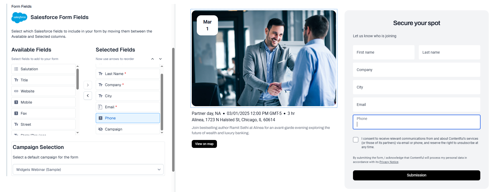

# Salesforce Leads – Contentful App

This project implements a **Contentful App** that lets editors compose a Salesforce _Web-to-Lead_ form directly inside an entry. The package is purposely small and focused – everything you need to understand, compile and deploy lives in this repository.

---

## Local development

```bash
# install
npm ci            # or yarn / pnpm install

# local dev
npm run dev

# linting
npm run lint

# unit tests
npm test

# production build
npm run build
```

The default `dev` command will open the Vite dev-server on `localhost:5173`. When the app is **not** running inside Contentful you will see `LocalhostWarning`. Install and open the app inside the Contentful UI to see the real screens.

---

## Locations

The app registers two UI locations (see `src/App.tsx`):

| Location constant      | Component      | Responsibility                                                              |
| ---------------------- | -------------- | --------------------------------------------------------------------------- |
| `LOCATION_APP_CONFIG`  | `ConfigScreen` | Collect Salesforce Connected-App credentials once per space.                |
| `LOCATION_ENTRY_FIELD` | `Field`        | Allow editors to pick & order Salesforce lead fields for the current entry. |

---

## Field selection logic (`src/locations/Field.tsx`)

- **Source of truth** – `SALESFORCE_FIELDS` array (~25 common lead fields).
- Editors can **move** items between _Available_ ➡ _Selected_ lists and **re-order** them with ↑/↓ buttons.
- Some fields are _required_ (`first_name`, `last_name`, `email`, `company`) and cannot be removed.
- Optional **Campaign** can be chosen when the hidden `Campaign_ID` field is included.

Every change triggers `sdk.field.setValue()` which persists a JSON payload **in the current entry field**.



---

## Editor Field Value JSON schema

```jsonc
{
  "fields": [
    {
      "id": "first_name", // Salesforce API name
      "label": "First Name", // human readable label
      "type": "text", // one of: text | email | url | tel | select | textarea | number | hidden | checkbox
      "required": true, // optional, omitted when false
      "options": ["…"] // only for type === "select"
    }
    /* …other selected fields in visual order… */
  ],
  "campaignId": "********GeCES", // optional – default campaign Id
  "organizationId": "********01gPF" // Salesforce Org Id copied from Config screen
}
```

---

## Deployment to Contentful

1. Build a production bundle: `npm run build` – output is written to `dist/`.
2. Upload & activate the bundle:
   - interactive – `npm run upload`
   - CI friendly – `npm run upload-ci` (env-vars required – see package.json)

The commands are thin wrappers around `@contentful/app-scripts` which creates / updates the AppDefinition and uploads the bundle.

---

## Testing

```bash
npm test
```
