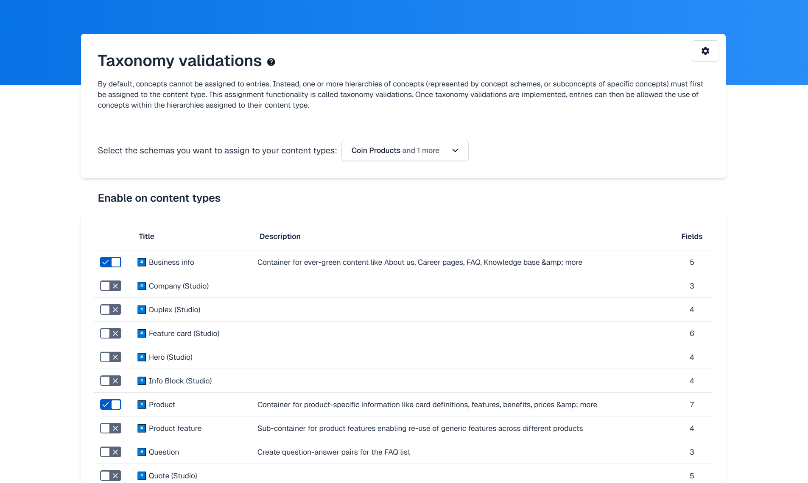
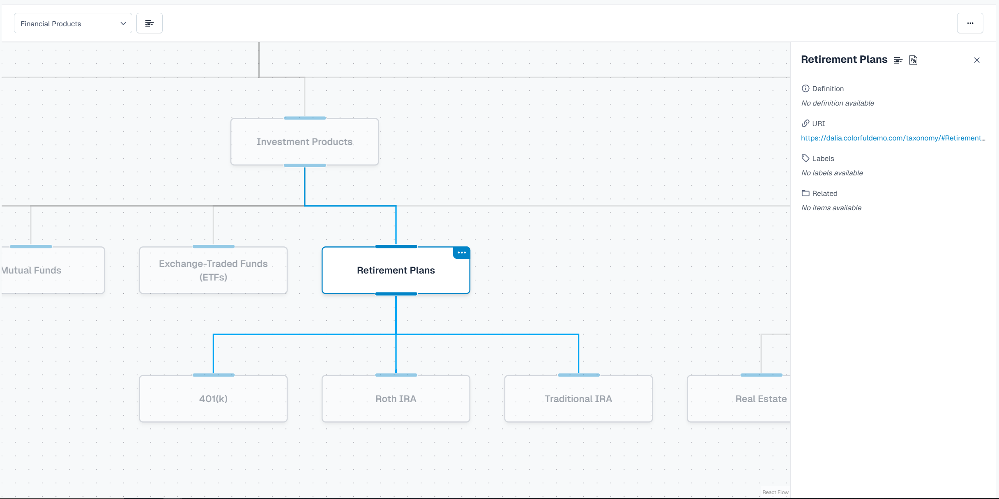

# TaxGraph – Contentful App

This repository contains a **Contentful App** that lets editors explore, validate and deep-link complex taxonomies (Concept Schemes & Concepts) directly inside the Contentful web application. All code required to understand, build and deploy the app lives in this repo.

---

## Local development

```bash
# install
pm ci            # or yarn / pnpm install

# local dev
npm run dev

# linting
npm run lint

# unit tests
npm test

# production build
npm run build
```

The default `dev` command starts the Vite dev-server on `localhost:5173`. When the app **is not** rendered inside Contentful you will see the `LocalhostWarning` component – open the app inside Contentful to access the real UI.

---

## Locations

| Location constant      | Component      | Responsibility                                                                                    |
| ---------------------- | -------------- | ------------------------------------------------------------------------------------------------- |
| `LOCATION_APP_CONFIG`  | `ConfigScreen` | Collect a CDA token and enable taxonomy validation for selected content-types.                    |
| `LOCATION_ENTRY_FIELD` | `Field`        | Show concepts attached to the current entry and provide quick links to manager & related content. |
| `LOCATION_PAGE`        | `PageLayout`   | Interactive graph visualisation of Concept Schemes & Concepts with layout / orientation controls. |

---

## Configuration screen (`src/locations/ConfigScreen.tsx`)

- **API access** – validates and stores a Content Delivery API token (`cda_key`).
- **Content-type switcher** – toggle taxonomy validation per content-type.
- **Schema filter** – pick which Concept Schemes should be applied in the validation.



---

## Graph exploration logic (`src/components/PageLayout.tsx`)

- **Data source** – Concept Schemes & Concepts are fetched from the CDA in real-time.
- **Node details** – selecting a node opens an information panel (definition, labels, related concepts, deep-links …).



---

## Deployment to Contentful

1. Build a production bundle: `npm run build` – output is written to `dist/`.
2. Upload & activate the bundle:
   - interactive – `npm run upload`
   - CI friendly – `npm run upload-ci` (requires `CONTENTFUL_ORG_ID`, `CONTENTFUL_APP_DEF_ID`, `CONTENTFUL_ACCESS_TOKEN`)

Both commands are thin wrappers around `@contentful/app-scripts` which creates/updates the AppDefinition and uploads the bundle.

---

## Testing

```bash
npm test
```

Unit & utility tests are powered by **Vitest** and run in a _happy-dom_ environment to simulate the browser.
