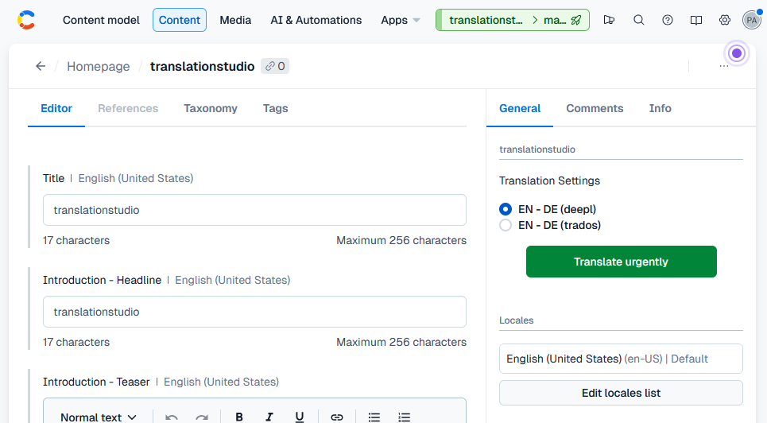
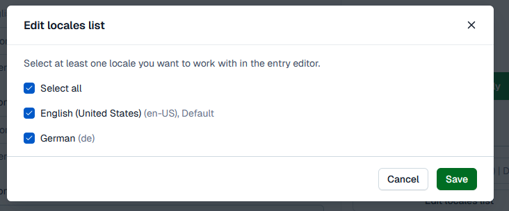
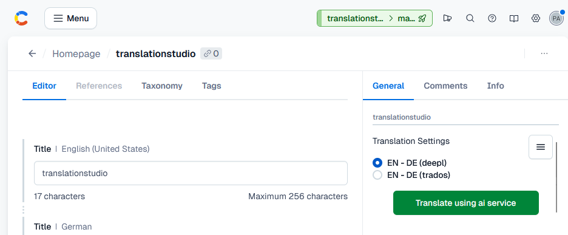

# How to use translationstudio

translationstudio is designed to be simple to use. Once installed and configured, you will find the extension in your sidebar.

## Adding locales to your content

First of all, you need to specify which locales are available in your content object.

To do so, click on the **edit locales list** button in your sidebar and choose which languages are to be made available. This documentation assumes your will have English as your default language and German as a second language.

## Translating content

You will see localizable text fields available in your content section.

Finally, you can choose the appropriate translation setting from the translationstudio extension and submit the content for translation.

Depending on your translation settings, you may find additional translation options available. All AI translations will be processed immediately, but with translation management software, you may provide additional information, set a deadline and choose if this translation request is to be processed immediately or if its submission should wait until certain quota settings are met (these are configured with your translationstudio account).

That's it.