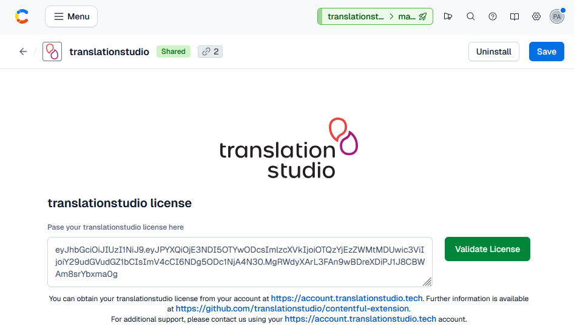
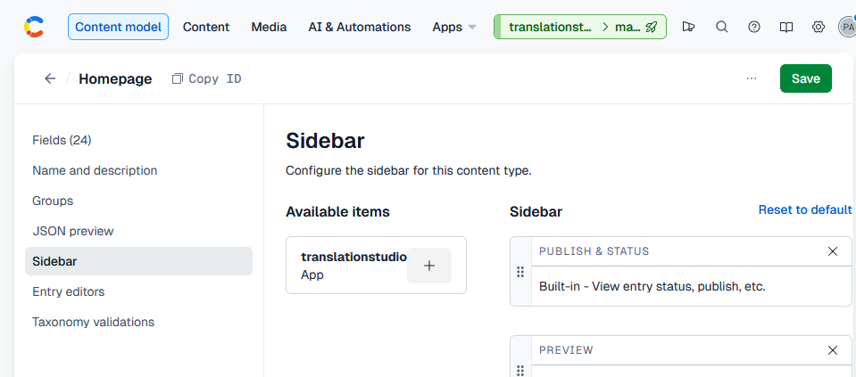
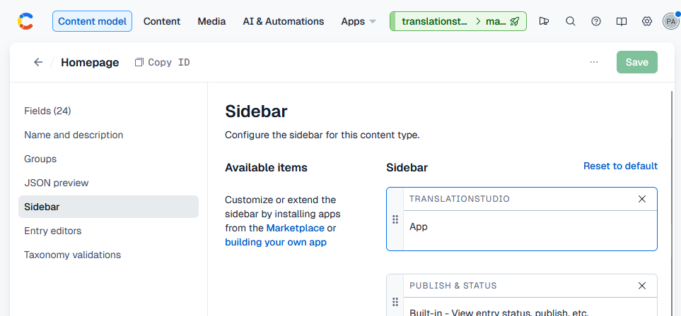

# Installing translationstudio

> [!NOTE]
> You need to create a [translationstudio.tech](https://translationstudio.tech) license to configure this extension.

## Installation

### Installation as a custom extension

To add this extension to your Contentful organisation, please follow the steps below:

1. Open your **Organization settings & subscriptions** and navigate to **Apps**
2. Create a new app
3. Provide the name `translationstudio`
4. Add the frontend URL, e.g. `https://contentful.translationstudio.tech` 
4. Select the **Locations** `App configuration screen` and `Entry sidebar`
5. Click on **Save**
6. Install the app to your space(s)

You will need to configure the app in each space. You can find it at **Apps** - **Installed Apps**

### Installation from the Contentful marketplace

This documentation will be updated once the extension has been added.

## Configuration

Once added to your space(s), you need to configure the app in each space. You can find it at **Apps** - **Installed Apps**

All you need to do is adding your translationstudio license created in your [translationstudio.tech](https://account.translationstudio.tech) account.

> [!NOTE]
> Your connections to translation memory systems and access settings will be configured with your translationstudio account.

To allow translationstudio to access your space(s), you will need to create respective **CMA tokens** (Settings menu of your space). These will be needed when configuring the translationstudio Contentful connector with your translationstudio account.

> [!IMPORTANT]
> translationstudio will only use these tokens in order to export content to be translated and to import translated content. We never share your tokens with others.

## Adding translationstudio to your content models

You can specify which content models will need translationstudio capabilities. 

To add translationstudio to your content model, head over to its respective configuration and navigate to the **Sidebar** configuration.

Choose translationstudio from your **Available items** by clicking on the `+` icon. 

**Save** your changes and repeat this process for each content model where relevant.